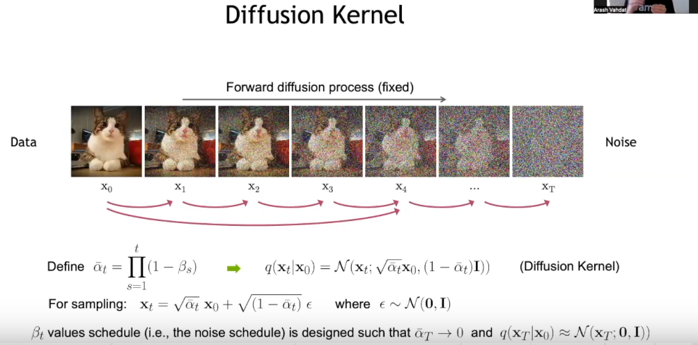
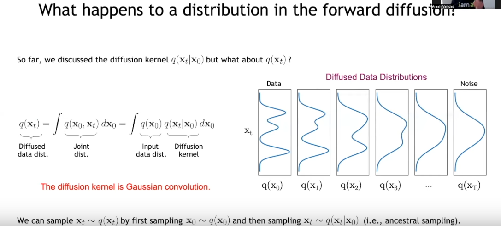

# Diffusion

## Denoising Diffusion-based Generative Modeling: Foundations and Application by Arash Vahdat
1. Introduction:
   1. It's a generative model as GAN, but works in a different manner
   2. It can take a low resolution image and generate a high resolution one.[Super-resolution]
2. Denoising Diffusion Probabilist Models:
   1. 
      1. How it converts noise to data by keeping the normal distribution at each time step.
      2. It diffuses the input data by adding a simple Gaussian noise.
      3. At end of the diffusion process, the data will have a normal standard deviation. 
   2. As the diffusion goes forward, its distribution becomes smoother and smoother.
      1. This smoothing process can be represented as Gaussian convolution 
      2. 
      3. We don't have access to explicit distributions of input data nor the intermediary distribution, therefore, we sample from training data and simply add Gaussian filter
   3. 
      1. Based on what he says in this image there is a way to mimic the parametric model of the denoising section
      2. The beta should small and ...
      3. It assumes in the reverse process like the forward process samples are normal distributions which their mean is a predicted by parametric model
      4. This trainable model could be a U-Net or a Denoising Autoencoder model. 
   4. Learning Denoising Model: Variation upper bound
      1. Using variation upper bound, KL-divergence, re-parametrization techniques, and a simple constraint that the value which was used at the diffusion process is known the formula for training mean would become simple. It's discussed in Ho et al. NeurIPS 2020. In addition, they do some relaxation over loss-function it works perfectly :)
      2. 
      3. He talked about unet-networks, the time representatives like in transformers which are used to show the time step and ...
      4. He talked about hierarchical variational encoders and how sampling is done... 
   5. summary
      1. 
3. Score-based Generative Modeling with Differential Equations
   1. I couldn't understand a word of the guy talked about :)
4. Advanced Techniques: Accelerated Sampling, Conditional Generation, and Beyond
   1. 
      1. Generative models are fast and generate high quality samples
      2. Likelihood-based models like variational autoencoders. They are good at generating diverse and fast samples
      3. Diffusion models generate diverse and high-quality images, but they slow :(
      4. In training process of a dataset the model should  
      5. Obviously, in this section, she tries to talk about to increase the speed of diffusion models
   2. Watched till 1:54:00

### References: 
1. https://www.youtube.com/watch?v=cS6JQpEY9cs
2. https://cvpr2022-tutorial-diffusion-models.github.io/