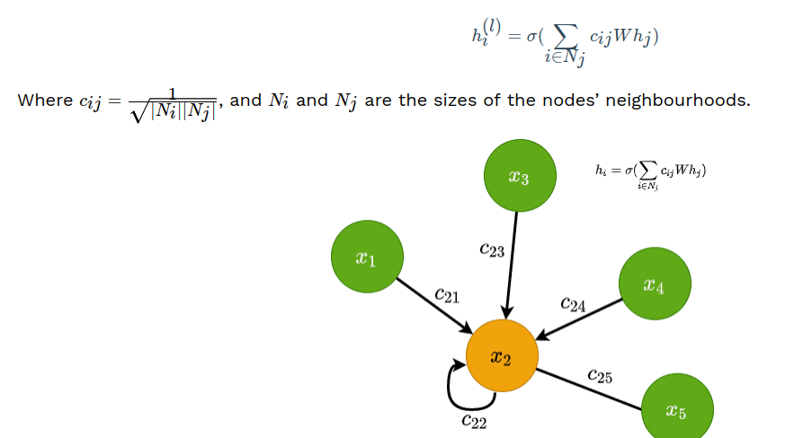
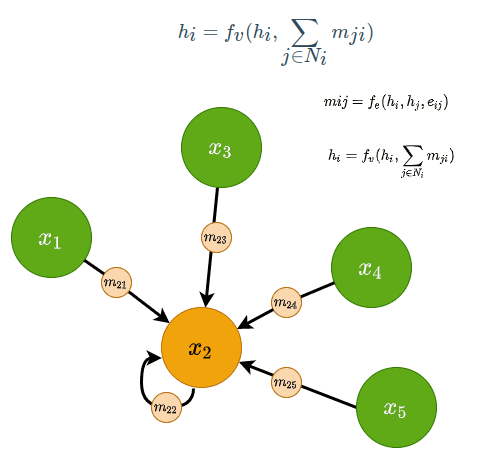
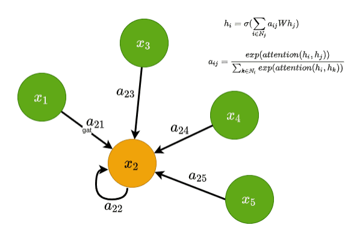
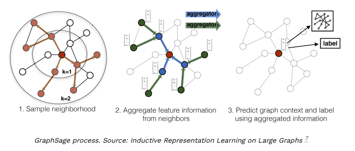
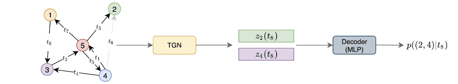
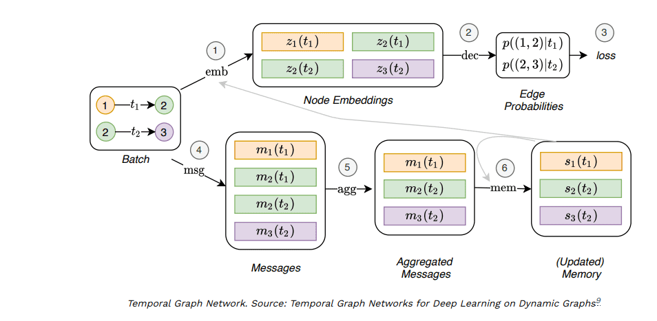

# Best Graph Neural Network architectures: GCN, GAT, MPNN and more
1. GCN:
   1. Computationally effective than their predecessors
   2. They don't directly support edge features.
   3. They omit the notion of messages in graphs. Typically, nodes can send messages (numeric vectors) along graph edges
   4. 
2. Message Passing Neural Networks
   1. Using an MLP takes into account consideration both the nodes' and edges' features
   2. They are the most general GNN available, but since they should process edges' and node's features, they suffer from scalability issues.
   3. They are mainly used for small graphs
   4. 
3. GAT:
   1. Node features are given to an attention module to define the coefficient of each node, therefore, coefficients are trainable parameters...
   2. In addition to node features, edge information can be included as well.
   3. Different attention modules are incorporated like multi-head attention and additive score function
   4. The coefficient does not depend on the graph structure. Only on the node representation.
   5. GATs are fairly computationally efficient.
   6. They are quite scalable.
   7. 
4. Sampling methods
   1. Instead of using all neighborhood information, we can sample a subset of them to conduct propagation.
5. GraphSage
   1. Sample uniformly a set of nodes from the neighborhood.
   2. Aggregate and perform classification
   3. 
   4. Training:
      1. training model in a fully unsupervised way. nearby nodes should have similar representation and disparate ones should have distinct ones.
      2. A supervised manner is used for representation learning as well...
6. PinSAGE: direct continuation of GraphSAGE. A recommendation model used by Pinterest.
   1. node's neighborhood is defined using random-walks. 
   2. Aggregation is performed using "importance sampling." In importance sampling, we simply normalize and sum up the importance scores generated by the random walks.
   3. The model is trained in a supervised fashion on a dataset of nodes connected based on the users historic engagement on Pinterest.
7. Dynamic Graphs:
   1. Graphs whose structure changes over time.
   2. Social networks are compelling examples of this.
8. Temporal Graph Networks (TGN)
   1. A type of dynamic graphs.
   2. At each time t, we can get a snapshot of the graph.
   3. The neighborhood at a particular time t is called a temporal neighborhood.
   4. The goal of TGN is to predict node embeddings at a particular timestamp. These embeddings are fed into a decoder network that will perform the task at hand.
   5. 
   6. A model from twitter. Self supervised. The nodes represent the tweets and the edges the interactions between them. Predicts upcoming interaction between users.
   7. 
      1. The node features of the temporal neighbourhood at a particular time. We simply pass the features from the neighbourhood to the GAT module, which will transform them, aggregate them, and update the hidden representations.
      2. The node’s memory. The node’s memory is a compact representation of the node’s past interactions. Each node has a different representation for each timestamp. The memory is updated using messages, as we described in MPNNs. All the messages from different nodes are aggregated and processed by the memory module which is usually implemented as a Recurrent Neural Network (RNN).
## References: https://theaisummer.com/gnn-architectures/