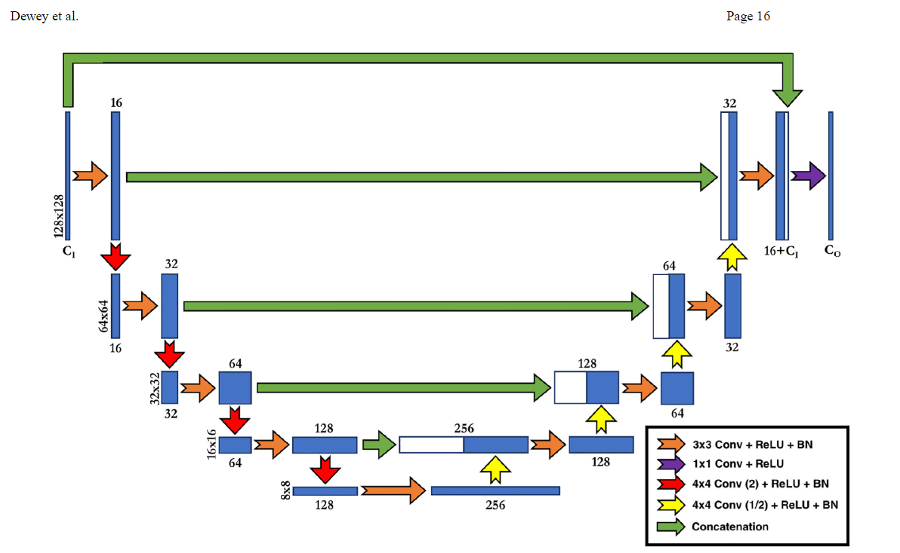

# Harmonization

## A deeplearning-based multisite neuroimage harmonization framework established with a traveling-subject dataset
### Abstract:
1. image harmonization is done to remove the artifacts created on neurimages due to different capturing devices.
   1. Some images from different sites might have different site effects which must be removed!

## DeepHarmony: A deep learning approach to contrast harmonization across scanner changes
1) Abstract: 
   1) Using Unet they want to mitigate the scanner result over a cohort of MS patients
2) Harmonization(U-Net Implementation)
   1) 
   2) Unet has a new concatenation at the end: they concat the inputs channel to the layer prior to final layer
      1) The first green arrow
      2) This allows the network to include the input contrasts in the final 1x1 convolutional layer, directing the final feature maps to only augment the input contrasts, instead of recreating the target contrasts entirely.
   3) The second innovation is the use of strided convolutions instead of pooling layers
      1) They believe that using 4*4 kernels eliminates the artifacts created by strided conv and upsampling layers reported previously.
3) Network Training:
   1) Mean Absolute Error was used as the training loss function
      1) So small differences could contribute as well
   2) Adam
   3) No Dropout or regulation
   4) SSIM was used and MAE were used as validation metrics
   5) 