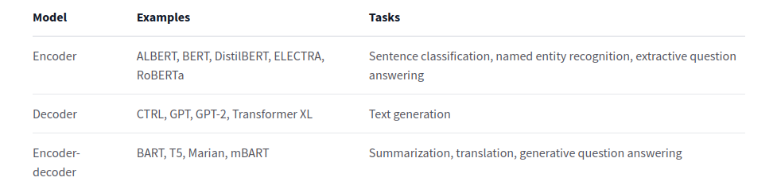

# Transformers
## Transformers models
1. How do Transformers work?
	1. Grouping different libraries
		1. GPT-like (also called auto-regressive Transformer models)
			1. called auto-regressive because it does not uses the future information
			2. The decoder architecture in the Transformer models is an auto-regressive one because it's uni-directed.
		2. Bert-like (also called auto-encoding Transformer models)
		3. BART/T5-like(also called sequence-to-sequence Transformer models)
	2. Architectures vs. checkpoints
	   
	   As we dive into Transformer models in this course, you’ll see mentions of architectures and checkpoints as well as models. These terms all have slightly different meanings: 
		- Architecture: This is the skeleton of the model — the definition of each layer and each operation that happens within the model.
		- Checkpoints: These are the weights that will be loaded in a given architecture.
		- Model: This is an umbrella term that isn’t as precise as “architecture” or “checkpoint”: it can mean both. This course will specify architecture or checkpoint when it matters to reduce ambiguity.
		1. For example, BERT is an architecture while bert-base-cased,  a set of weights trained by the Google team for the first release of  BERT, is a checkpoint. However, one can say “the BERT model” and “the bert-base-cased model.”
2. Encoder Model
	1. The Transformer's Encoder returns a numerical representation for each input text which also can be called a feature vector or a feature tensor.
		1. For the BERT model, the dimension of the representation is 768.
		2. These representations take into account adjacent words, not just the main word corresponding to that vector. That's why it's called contextualized value.
	2. These models are suited for:
		1. Bi-directional: context from the left, and the right.
		2. Good at extracting meaningful information
		3. Sequence classification, question answering, masked language modeling
		4. NL: Natural Language Understanding
	3. BERT, Albert, ELECTRA, RoBERTa, etc.
3. Decoder Model
	1. CTRL, GPT, GPT-2, Transoformer XL.
	2. These models are suited for:
		1. Unidirectional: access to their left (or right!) context
		2. Great at causal tasks; generating sequences
		3. NLG: Natural Language generation
		4. Example of decoders: GPT-2, GPT Neo.
4. Sequence-to-sequence models
	1. BART, mBART, Marian, T5
	2. These models are suited for:
		1. Sequence to Sequence tasks; many-to-many translation, summarization.
		2. Weights are not necessarily shared across the encoder and decoder.
		3. Input distribution different from output distribution.
	3. For summarization tasks, we can have a long context for the encoder and a smaller context for the decoder model.
5. summary:
		1. 
## Using hugging-face transformers
1. Behind the pipeline:
   2. 
2. Tokenizers:
    1. Word-based
    2. Character-based
    3. subword-based
    4. Byte-level BPE, as used in GPT-2
    5. WordPiece, as used in BERT
    6. SentencePiece
3. Fine-tunning a pre trained model
	1. Processing the data
		1. With DataCollatorWithPadding one can pad a batch of samples instead of the whole dataset. 
		2. Each batch can have different padding it increases the training process.
		3. using it is easy:
			1. from transformers import DataCollatorWithPadding
			2. data_collator = DataCollatorWithPadding(tokenizer=tokenizer)
			3. batch = data_collator(samples)
		4. It needs a tokenizer. If it needs a tokenizer how it can be applied to a dataset?
4. Attention Mask: 
	1. When using a tokenizer directly in transformers it returns the ids and an attention mask. It is a list of ones for a single sequence, but if you are using padding it will pad the text with zeros, nans or whatever they should not insert to attention mechanism. The attention mask is zero for the padding vocabs.
	2. The ids for the padded indices are zero too.
5. dataset:
	1. dataset library is part of transformer group.
	2. While using dataset.map it seem increasing num_proc is not supported in jupyter-notebook.
		1. set to 1 all the time.

## How to train with transformers and PyTorch
1. What is tokenizer in transformers:
	1. with the tokenizer you can tokenize your inputs and get back inputs_ids, token_type_ids, and attention_mask
	2. these three are necessary for almost all of the bert-based models.
2. transformers library has a simple way of training models. In this case, we'll focus on the Trainer:
	1. A Trainer is a simple class that lets you train a specific model.
	2. A Trainer needs a Training Algorithm instance and a model
	3. to feed data to Trainer you need to extend the Dataset class. You have to add two methods:
		1. the first one is __getitem__(self, idx):
			1. this one should return an item, the item should contains dict_keys(['input_ids', 'token_type_ids', 'attention_mask']) and a 'label' variable
			2. Note: the encodings have the three sections above, but they don't have the label
		2. the second one is __len__: this returns the length of the dataset from which the number of steps is derived.
	4. The Trainer itself creates the DataLoader( no need to bother )
	5. you can get a model from bertfor blah blah or you can generate your own model
	6. you can define an optimizer for the trainer using the line below:
		1. trainer.optimizer = AdamW(model.parameters(), lr=5e-5)
	7. you can set learning_rate argument for TrainingArguments too. 
	8. you can set load_best_model_at_end to make sure the model saves the best model all the time.
	9. save_total_limit=1 is very important, if you want to have one checkpoint you need to set to 1.
	10. Here is the code: With the below TrainingArguments only the best model based on eval_loss will be saved.
```
# train_texts is a list of texts
# labels is a list of targets
MODEL_NAME = "HooshvareLab/bert-fa-base-uncased"
tokenizer = BertTokenizerFast.from_pretrained(MODEL_NAME)
train_encodings = tokenizer(train_texts, max_length=256, truncation=True, padding=True)
class SentiDataset(Dataset):
    def __init__(self, encodings, labels):
        self.encodings = encodings 
        self.labels = labels 
    def __getitem__(self, idx):
        item = {key: torch.tensor(val[idx]) for key, val in self.encodings.items()}
        item['label'] = torch.tensor(self.labels[idx])
        return item
    def __len__(self):
        return len(self.labels)

train_dataset = SentiDataset(train_encodings, train_labels)

training_arguments = TrainingArguments(do_train=True,
                                       output_dir='./taghche_results', 
                                       num_train_epochs=3,
                                       per_device_train_batch_size=8,
                                       per_device_eval_batch_size=8,
                                       warmup_steps=1000,
                                       weight_decay=0.01,
                                       logging_dir='./logs',
                                       save_total_limit=1,
                                       evaluation_strategy='steps',
                                       do_eval=True,
                                       eval_steps=2500,
                                       logging_steps=50,
                                       learning_rate= 5e-5,
                                       load_best_model_at_end =True, # when set to true save step is ignored
                                       greater_is_better=False,
                                       metric_for_best_model= "eval_loss",
                                       )
model = BertForSequenceClassification.from_pretrained(MODEL_NAME)
trainer = Trainer(model = model, args=training_arguments, train_dataset=train_dataset, eval_dataset=val_dataset)
trainer.optimizer = AdamW(model.parameters(), lr=5e-5)
trainer.train()
```

What is the output of a trainer checkpoint:
1. only the pytorch_model.bin, config.json, and training_args.bin are necessary for the model, I believe the rest are for the trainer.
2. to load the saved model you can do: BertForSentenceClassificationFast.from_pretrained(path_to_the_folder_above)
Save the result of Trainer:
1.  trainer.save_model('path_to_model')
2. This line of code saves the model into  pytorch_model.bin, config.json, and training_args.bin
3. To load:  BertForSentenceClassificationFast.from_pretrained(path_to_the_folder_above)
How to get just config and bin file:
1. load the checkpoints using the below codes
	1. model = BertForSentenceClassificationFast.from_pretrained(path_to_the_checkpoint)
	2. model.save_pretrained(new_path)
2. If you want the tokenizer outputs too, run the below code:
	1. tokenizer.save_pretrained(new_path)
3. These two are necessary for the onnx format
How to predict:
```
def predict(model, tokenizer, sample, device='cpu'):
    model = model.to(device)
    sample = tokenizer([sample], max_length=MAX_LEN, truncation=True, padding=True)
    input_ids = torch.tensor(sample["input_ids"],device=device)
    attention_mask = torch.tensor(sample['attention_mask'],device=device)
    token_type_ids = torch.tensor(sample["token_type_ids"], device=device)
    model.eval()
    outputs = model(input_ids=input_ids,
                    attention_mask=attention_mask,
                    token_type_ids=token_type_ids
                   )[0]
    _, preds = torch.max(outputs, dim=1)
    return preds.numpy()
```

there are several approaches to load a model with transformers library, let check some of them:
```
# from checkpoint
classification = BertForSequenceClassification.from_pretrained('taghche_results/checkpoint-2500/')
predict(classification, tokenizer, 'خیلی بد بود')
```

Note:
the model which has been given to the trainer for the instance creation is not changed through training you need to load the model from checkpoints or the trainer's one

Validation: How to get validation after training:
```
from sklearn.metircs import f1_score, classfication_report

test_output = trainer.predict(test_dataset)
predictions, y_true, test_loss = test_output
preditions = F.softmax(torch.tensor(predictions), dim=1)
y_pred = np.argmax(predictions, axis=1)
f1 = f1_score(y_true=y_true, y_pred=y_pred, average='weighted')

acc = (y_true == y_pred).mean()
print(f'acc: {acc}')
print(f'f1-score: {f1}')
print(classification_report(y_pred, y_true))
```

## How to use ONNX
How to load the model using onnx:
1. onnx is cross-language framework which lets to run the deep-learning projects on C++, C, C#, and more languages
2. onnx is programmed on C++, which means it's faster 
3. based on the benchmarks it's 3 to 4 times faster than transformers models on GPU and 1.28 times faster on cpu.
Let see a code to use prepare a model with onnx:
1. there is a file named convert_graph_to_onnx.py in transformers directory
	1. to get the directory address do the below codes:
	2. import transformers 
	3. print(transformers.__file__)
2. copy the convert_graph_to_onnx.py to your directory.
	1. to make access easier 
	2. you can run the code with out copying too
3. you need to have the following files of your model inside a folder
	1. model_pytorch.bin
	2. config.json
	3. tokenizer_config.json
	4. vocab.txt
4. how to get the requested files
	1. the first two can be gained from model.save_pretrained or through checkpoint and other ways
	2. the last two can be gained from tokenizer.saved_pretrained
5. run the following code to get the onnx code
	1. python convert_graph_to_onnx.py --framework pt --model saved_model --output onnx_output/model.onnx --pipeline sentiment-analysis
6. notes:
	1. the folder of the onnx_output must be empty unless you'll get an error
	2. the pipeline matters, there are several pipelines like: ner, feature-extraction(this the basic bert)
		1. if you want to see all the pipelines just put a random word after pipeline it will show the possible pipelines in the error message😄
7. How to optimize it:
	1. pip install onnxruntime-tools
	2. python -m onnxruntime_tools.optimizer_cli --input onnx_output/model.onnx  --output onnx_output/sa_model.onnx --model_type bert
8. notes: if you have trained your model with distilbert change the model type( I haven't tested it)
how to use optimized code:
```
import os
import numpy as np
import transformers
from transformers import BertTokenizerFast
from onnxruntime import ExecutionMode, InferenceSession, SessionOptions

MODEL_NAME =  "HooshvareLab/bert-fa-base-uncased"
tokenizer = BertTokenizerFast.from_pretrained(MODEL_NAME)

options = SessionOptions()
options.intra_op_num_threads = 1
options.execution_mode = ExecutionMode.ORT_SEQUENTIAL
session = InferenceSession("taghche_results/onnx_output/classification_optimized.onnx", options)

tokens = tokenizer.encode_plus("خیلی خوب بود")
tokens = {name: np.atleast_2d(value) for name, value in tokens.items()}

output = session.run(None, tokens)
label = np.argmax(output[0],axis=1)[0]

print(label)
```

How to install torch-cpu:
```
pip install --no-cache-dir torch==1.10.0+cpu torchvision==0.11.1+cpu -f https://download.pytorch.org/whl/torch_stable.html
```

