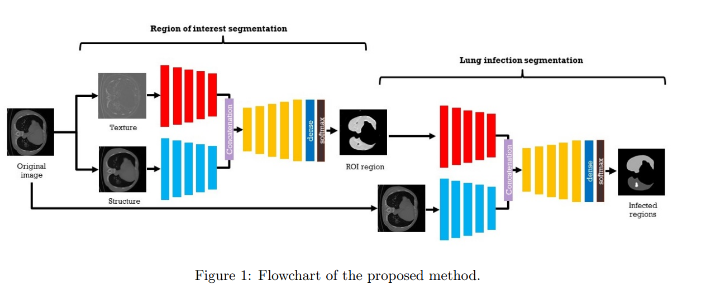

# Segmentation
## An encode-decoder-based method for COVID-19 lung infection segmentation
1. Abstract:
   1. They use a multi-task deep-learning-based
   2. CT-scan images
   3. mutli-task is used to overcome shortage of labeled data.
2. Method:
   1. 
   2. They used a technique to split input images to Texture and Structure
   3. bounded variation component (Structure) and a component that contains the oscillating part (Texture/Noise) of the image
   4. The extraction of the structure component uses gradient rescaling with interval gradients followed by a color handling operation.
   5. First they get the region of interest then they segment it again to get the infection
      1. This technique allows learning on the specific region and can be more accurate according to the data limitation
   6. They have proposed their models in two types:
      1. multi-class segmentation and binary segmentation
      2. Both types are trained in a multi-task approach
3. Results:
   1. They showed that their multi-class and binary-class multi-task segmentation works quite well compared to other methods which are not multi-task.
   2. They also show that other multi-task segmentation methods are the closest in accuracy to the one they have proposed