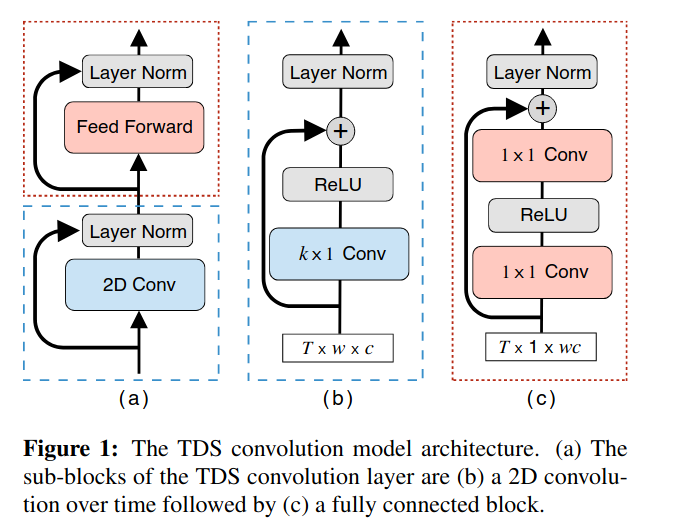

# Wav2Letter papers
## Wav2Letter: an End-to-End ConvNet-based SpeechRecognition System
1) Inputs: MFCC, power-spectrum, and raw-wave 
   1) MFCC dimensionality compression - 13 coefficients
2) Output: letter scores (one score per letter, given a dictionary L)
3) CNN model
   1) 1D convolutional neural networks
   2) pointwise activation func: 
      3) point-wise means it's applied to only one point in a vector. ReLU is point-wise activation function!
      1) HardTanh & ReLU led to same results
   3) strid & no pooling
   4) 
   5) raw-wave has a first conv-layer with a huge kernel-size=250 and a large stride(dw)=160 at the beginning of the arch with a large stride to compensate for the enormous input size(16KHz)
   5) MFCC & power spectrum do not have the first layer of the main arch
4) No CTC -> something like it
   1) ASG: Audio Segmentation Criterion which does not have blank letters and other features where used
   2) caterpillar is turned to caterpil2ar to solve the repetition problem.
5) beam search decoder
   1) Relies heavily on KenLM 
6) GitHub:
   1) https://github.com/silversparro/wav2letter.pytorch
   2) https://github.com/flashlight/wav2letter
   3) https://github.com/LearnedVector/Wav2Letter
      1) greedy decoder 
      2) ctc
7) Paper:
   1) https://arxiv.org/pdf/1609.03193.pdf

## Sequence-to-Sequence Speech Recognition with Time-Depth Separable Convolutions
1) Abstract-Introduction
   1) Time-Depth Separable (TDS) Convolutions is used
   2) Removed neural content attention, location based attention, and scheduled sampling.
      1) caused they are not fast :(
   3) efficient & stable beam search!
      1) accuracy does not degrade with very large beam search sizes!
2) TDS:
   1) 
      1) source: image is taken from the paper!
   2) The layer normalization is over all dimensions for a given example including time
   3) T is the time step and w is width of the input
      1) TODO -> explain what is T and W
      2) I think Conv-2D is applied on a spectrogram 
         1) It's 2d, and the first dimension is the time-step! 
   4) In first(blue) block, the conv is done only on Time and width is 1
   5) In the second(red) block, the view of the output is changed! 
   6) The TDS architecture has three sub-sampling layers each with a stride of 2 for a total sub-sampling factor of 8. 
      1) We also increase the number of output channels at each sub-sampling layer since we compress the information in time.
      2) For simplicity these layers do not have residual connections and are only followed by a ReLU and layer normalization.
   7) Overall, it seems to have increased the efficiency!
3) I didn't read the rest of the paper!
4) paper: https://arxiv.org/pdf/1904.02619.pdf

## SCALING UP ONLINE SPEECH RECOGNITION USING CONV NETS
1) Abstract-Introduction:
   1) CTC loss function
   2) Time-Depth Separable (TDS) Convolutions
      1) Improved the core architecture to limit the future context
         1) reduce the latency
   3) Highly optimized beam search decoder!
   4) Metrics: 
      1) throughput
      2) real-time factor
      3) latency
      4) word error rate
2) TDS:
   1) 
      1) Image is taken from the paper!
      2) Because, stride is one, in and out channels' sizes are equal to w*c
      3) filer size: kw
      4) n_groups: w,
      5) asymmetric padding: kw -1 -rPad, rPad
         1) some time this type of padding is referred as asymmetric convolution because the kernel of convolution is not symmetrically aligned on the inputs
      6) Linear layers are Conv-1D channels
   2) Grouped convolutions dramatically reduce the number of parameters.
      1) This was not used in the previous types of TDS
   3) efficient computation & small model size!
   4) limiting the future context for convolution operations in TDS, which is necessary for maintaining lowlatency, leads to a small degradation in WER
      1) **TODO:** what is future contex!
      2) I think future context in this field, is the audio/speech input that can be perceived with the model. The longer it is, the better accuracy provided, and results in lower latency.
         1) In this work future context is set to 250ms!(no sure about this number)
         2) 
         3) It's clear form the image that future context is the amount of audio that is taken for inference. If future context is 500ms, the model will not process a `yes` word that might have uttered in less than 500ms, so the user will experience a latency! 
         4) On the other hand, larger future context will help model to have higher accuracy(WER) at inference time!
      3) By training model with TDS(10, 9,80, 1) (generated padding -> 8), instead of TDS(10, 9,80, 4) (generated padding -> 5), the input will be dependent to only two input frames because the padding is asymmetric.
      4) I think, in this way, the minimum requested audio for starting the process will decrease which can improve latency, however, it degrades the WER!
   5) Differences from previous work:
      1) 1-D convolution with asymmetric padding for convolutions is used.
         1) It adds more zero padding which alleviates the impact of the number future inputs needed to generate the current output.
      2) Removing time dependency of layernorm
         1) normalization is done across the width and channel and not the time->
            1) therefore, it won't depend on time and will help the process of streaming!
3) Architecture:
   1) 
   2) the Conv-1D in the middle are used for subsampling and increasing the channel.
   3) output is a Linear of the size of tokens! 
   4) Finally, a CTC loss is applied!
   5) 104 million parameters
   6) subsampling: 8
   7) input: 80 dimensional log mel-scale filter bank
   8) stride: 10ms -> receptive field of ~10 seconds per frame & future context of 250ms 
4) Online Beam Search Decoding:
   1) saves the history to make the refinement of the past possible
      1) In other words, they may change the previous transcription
   2) they use k equal to 50 tokens.
   3) They propose the blank symbol if its posterior probability is larger than 0.95
   4) These changes make it very fast!
5) Training:
   1) 5000 sub-word tokens -> SentencePiece
   2) SpecAugment -> data augmentation
   3) local normalization is done to make streaming friendly. By the increase of input audio the local normalization is applied to a larger audio set.
   4) maximum audio size is n=300
6) ablation study:
   1) future context limitation has the most contribution to the degradation in WER.
7) paper: https://scontent-lga3-1.xx.fbcdn.net/v/t39.8562-6/240725501_3098768117076897_6630180935892341235_n.pdf?_nc_cat=108&ccb=1-7&_nc_sid=ad8a9d&_nc_ohc=y5plEEdiC44AX9T6OGx&_nc_ht=scontent-lga3-1.xx&oh=00_AfDh-VThWVtcalZVznHWPguNv2KcIjXkKWh8ozH9UGuqFg&oe=636AD644
8) All the images are taken from the papers!

