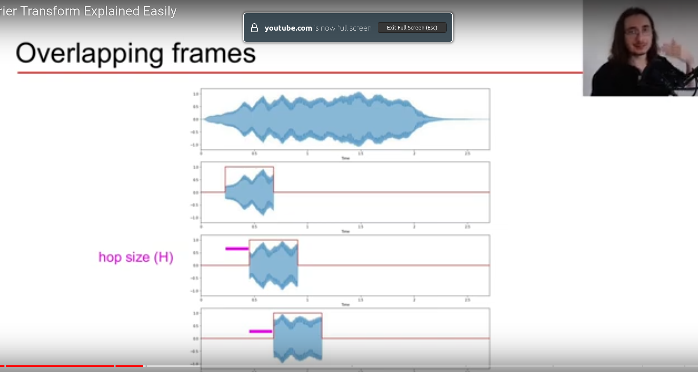

# Wave

1) To describe a sound wave we have some information as below:
2) 
    1) Frequency: Is the inverse of Period.
        1) Number of cycles that happens in a second.
        2) 1 Hz: 1 cycle per period
        3) higher frequency results in higher pitch
    2) Amplitude: is the maximum magnitude value a wave can have. The scale of the amplitude is Pascal. Because showing
       the true pascal values could mess up graphs most of the time the graph readability is preferred over actual
       values and instead of 10.000.000 Pa the 10 is shown.
        1) Loud sounds have larger amplitude
            1) Loudness is defined in terms of the ratio of a sound pressure level (serving the role of output power) to
               the auditory threshold sound pressure level (serving the role of input power)
        2) to be clear, the scale of **sound pressure level** is Pascal and the **loudness scale** is **decibel** which
           is the relative sound pressure.
            1) loudness is indicated with dB.
                1) dBFS, or decibels relative to Full Scale, is used to measure digital audio signal levels. dBFS is
                   another dimensionless quantity, because it is just a number and cannot be converted to another unit.
                2) It starts from zero to -infinity
                3) -6 db is equivalent to 50% of the maximum level
                    1) -inf - -6 -> 0-50%
                    2) -6 - 0 -> 50-100%
                4) decible aligns better with how we hear sound.
                5) equation:
                    1) 20 log10(Am/Ar) -> 20 log10(Am)
                        1) Am: measured amplitude
                        2) Ar= reference amplitude -> maximum possible amplitude before clipping which is one
                    2) Am = 0 -> db = -inf
                    3) Am = 1 -> db = 1
                    4) Am = 0.5 -> db = -6
                6) The level of 0 dBFS(db-full-scale) is assigned to the maximum possible digital level.
                    1) For example, a signal that reaches 50% of the maximum level has a level of −6 dBFS, which is 6 dB
                       below full scale.
                    2) Conventions differ for root-mean-square (RMS) measurements, but all peak measurements smaller
                       than the maximum are negative levels.
            2) Max pressure is indicated with Pa
                1) Normal conversation sound pressure ranges from 0.002 Pa to 0.2 Pa.
                    1) In comparison, a trumpet sound pressure reaches a sound pressure level of 63 Pa.
                    2) A jet engine sound pressure level reaches a sound pressure level of 632 Pa.
                    3) These pressure levels tell you that the human voice exerts less pressure on the surrounding air
                       molecules than a trumpet. And, the trumpet exerts less pressure on the surrounding air molecules
                       than a jet engine.
                2) Calculation of the decibel level of a sound pressure level is computed by the following equation:
                    1) dB(SPL) = 20 log10(p/p0)
                    2) P0 = reference pressure level of auditory threshold(Pa) = 20 micro Pa(this is the minimum
                       threshold for human ear)
                    3) dB (SPL) values computed by this formula are commonly called the loudness of the sound.A sound
                       source with a higher dB (SPL) level is considered to be a louder sound.
                    4) Fact:
                        1) An increase of 6 dB (SPL), doubles the loudness of the sound.
                        2) this indicates increase of 6 dB means the pressure of the sound has been twiced.
                        3) an increase of 10 dB (SPL) triples the loudness of the sound.
    3) Frequency vs Loudness:
        1) Frequency and loudness are two different characterizations of sound. Frequency is an absolute value that
           describes the oscillations of a vibrating sound source. Loudness is a relative value that compares the sound
           pressure level of the sound wave of one sound with the sound pressure level of a sound at the auditory
           threshold.
        2) Changing the loudness of a sound has no effect on its frequency.
        3) frequency describes oscillation while loudness describes sound pressure level relative to the auditory
           threshold.
        4) A general sound consists of the combination of multiple frequencies. This fact was determined by Wiener in
           his application of the wave theory of Fourier to frequency variables.
        5) Loudness of a specific frequency within a specific and general sound cannot be determined. This limitation is
           a result of modern sound recording equipment. Loudness can be determined for the complete sound, not for
           frequencies within a complete sound.
        6) However, loudness of a frequency can be determined if the sound consists of a single frequency. A sound that
           consists of a single frequency is called a pure tone. Audiologists use pure tones when testing a person’s
           hearing
        7) When there are more than one frequency we can't determine the loudness.
    4) Frequency formulation:
        1) f(t) = a * sin(2 * pi * f * t)
        2) t = time (seconds)
        3) a = maximum amplitude
        4) f = frequency (cycles/sec or Hz)
        5) f(t) = amplitude of sound wave at time t (Pa or [-1, +1])
    5) Period:
        1) Period is the time in seconds between two crests of a waveform. It could also be determined between two zeros
           or two troughs.
        2) P = 1 / f
        3) where
        4) P = period (sec)
        5) f = frequency( cycles / sec or Hz)
    6) Wavelength:
        1) wavelength of a sound wave is the length of the beginning of the positive pressure to the end of the negative
           pressure.
        2) W = c/f
        3) where
        4) W = wavelength
        5) c = speed of sound(meters/second)(300 m/sec) ( speed of sound in a specific medium)
            1) Sound travels at a speed of 340.29 meters/second at sea level
            2) Speed of sound varies depending on the density of the atmosphere
            3) Both temperature and atmospheric pressure affect the speed of sound
            4) Studies show that humidity does not affect the speed of the sound.
        6) f = frequency (cycles / sec or Hz)
        7) if f = 1 Hz and c is 300 m/s the wavelength is 300 meters per 1 Hz
3) https://hometheaterhifi.com/technical/technical-reviews/audio-frequency-loudness-part-introduction-basics/
4) pictures are taken from the above-mentioned website.

# Analog to digital:

1) 
2) Sample rate
    1) sample rate for librosa is 22050Hz
    2) old cds' sample rate is 44100Hz
3) bit-depth is the quantization accuracy.
    1. higher bit depth means we can sample with finer details.
    2. 16 bits means we can have 16 concrete numbers.

# FFT -> Fast Fourier Transform 
1) To decompose time domain to frequency domain, FFT is used!

# DFT: Discrete Fourier Transform
1) Spectral Vector (#frequency bins)
2) N complex Fourier Coefficients
3) Everything is averaged over the whole duration of the signal!

# STFT: Short-Time Fourier Transform
1) 
2) Applying each fourier transform upon each frame would let us access the time domain as well as the frequency domain! 
3) frame-size: The amount of audio chunk that is used to perform fourier on it
4) window-size: It's an equation that is multiplied to the frame
   1) most of the time, their length are the same
   2) A window function can be rectangle. 
   3) Most of the time, hann window function is used
   4) 
   5) This will avoid discontinuity at the ends!
   6) It prevents spectral leakage!
5) hot size (H): how many samples we slide to right to take new frame. Equivalent to stride!
   1) Setting hot size to frame size means there is no overlapping! 
   2) 
   3) half of the frame size most of the time!
6) What we get:
   1) Spectral matrix(#frequency bins, # frames)
   2) Complex Fourier Coefficients
   3) Note:
      1) frames are proxies for time. They are not exact because in each time frame we get approximation for whole the segment.
7) #frequency bins = framesize/2 + 1 -> check DFT for more information
8) #frames = (samples - framesize)/ hop-size + 1
9) Example:
   1) signal: 19k, frame-size: 1000, hop-size= 500
   2) frequency-bin: 501, frames= 19
   3) stft: (501, 19)
## Time / frequency trade off
1) large frame size -> high frequency resolution & lower time resolution
   1) why lower time resolution: because we are averaging over a large chunk of time
   2) With larger number of frequency bins the frequency resolution increases

## Spectrogram
1) To visualize sound we can use spectrogram
2) Using heat map we can visualize the frequencies
3) Formula: Y(m, k) = |S(m, k)|^2
4)  
   1) As mentioned earlier, time is discrete. Each chunk is a frame. Each discontinuity represents a frame.
   2) In the y axis, we have the frequency bins.
      1) We can see how different frequency component evolve through time!
5) Code:
```python
frame_size = 2048
hop_size = 512
s_wave = librosa.stft(wave, n_fft=frame_size, hot_length=hop_size)
print("(bins, frames) ->", s_wave.shape, s_wave.dtype)
# (bins, frames) -> (1025, 342), numpy.complex
spectrogram = np.abs(s_wave) ** 2 # :)
print("(bins, frames) ->", spectrogram.shape, spectrogram.dtype)
# (bins, frames) -> (1025, 342), numpy.float
s_log_wave = librosa.power_to_db(spectrogram) # scales the amplitude of the sound to db
```
## Power spectrogram
1) Spectrogram with Perceptually-relevant amplitude representation is power-spectrogram!
## Reference: https://youtu.be/-Yxj3yfvY-4


# Mel-Spectrogram
1) we perceive frequency logarithmically
2) Ideal audio feature:
   1) Time-frequency representation
   2) Perceptually-relevant amplitude representation
      1) vanilla spectrogram provides this for us
   3) Perceptually-relevant frequency representation
      1) Mel-spectrogram has all of them
3) Mel-scale
   1) Logarithmic scale
   2) Equal distances on the scale have same "perceptual" distance
4) mel: melody. 
5) m = 2595 * log(1+ (f/500)) -> this is an empirical formula
6) f = 700* (10^(m/2595) -1)
7) Recipe:
   1) Extract STFT
   2) Convert Amplitude to DBs
   3) Convert frequencies to Mel Scale
8) mel-bands: 
   9) How many mel-bands? It depends on the problem. It's like a hyper-paramer
      10) 40, 60, 90, 128
   11) Number of mel-bands kind of references to the number of unique(not quite sure about this term) frequencies that are used in the input audio. Mainly, 40 distinct frequencies are used in western music.
11) How to construct mel-filter banks
    12) Convert lowest/highest frequency to Mel
        12) m = 2595 * log(1 + (f/500))
    13) Create # bands equally spaced points
        10) Now that we have the lowest and the highest mel-banks
        11) We want to equally split the distance to the number of mel-banks we want to use.
    12) Convert points back to Hertz :)
        13) f = 700(10^(m/2595) - 1)
    14) Round to the nearest frequency
    15) Create triangular filters
        16) 
        17) In this image, we have six mel-bands
            18) ex: 1526 mel is equal to 2000 frequency Hz
        19) The image literally says, as we go further in terms of frequency, we should express more frequency to be perceptually understandable. This is the way we perceive peatch.
        20) The head of a triangle is one of the bands. The other two nodes of any triangle is the previous and subsequent mel-bands converted to frequency.
        21) Weights: is representative of how filter is going to be applied. Weights of 1.0 means zero filter bank
21) Mel filter banks' shape
    22) (#bands, framesize/2 +1)
23) Applying filter banks to spectrogram!
    10) M = (#bands, framesize/2 +1)
    11) Y = (freamesize/2 + 1, #frames) -> shape of a spectrogram!(nikoest frequency!)
    12) Mel Spectrogram = MY :) -> (#bands, #frames)
13) Mel-spectrogram:
    14) 
    15) It's no different from spectrogram. Here each frequency bin is a different mel-band.
    16) The way we show frequency in this time is more relevant to human perceiving.
    17) 

## Reference: https://youtu.be/9GHCiiDLHQ4