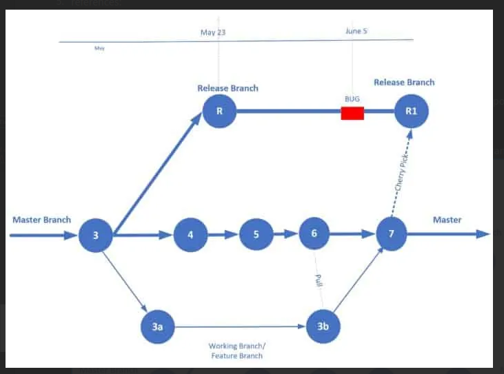

# Git

How to push a tag:

first you should create a local tag
```
git tag tag_name
```
then push it
```
git push origin tag_name
```

How to remove the local tag:
```
git tag -d  tag_name
```

How to remove the remote tag:
```
git push --delete origin tag_name
```

How to list local tags:
```
git tag -l
```

How to list remote tags:
```
git ls-remote --tags
```

How to clean a project and remove files which are not staged
```
git clean -df
```

 # this removes the newly added files
```
git reset --hard HEAD
```
 # this goes to the head commit you can use git log --oneline to find previous commits

How to checkout a newly added branch to remove repo:
```
git remote update
git fetch # or git fetch origin branch_name
git checkout -b branch_name
git pull origin branch_name
```
or
```
git checkout -b branch_name origin/branch_name
```

How to see all the branches:
```
git branch -a # shows the hidden branches
```

How to pull when you have made some changes:[stash]
```
git stash
git pull origin master
git stash apply
```
git stash will save your changes and return to the last commit and then you pull the master branch and then retrieve the stashed files using stash apply.

How to delete a local branch
```
git branch -d <local-branch-name>
```

How to list all git branches:
```
git branch -a
```

How to delete a remote branch
```
git push origin --delete <remote-branch-name>
```

How to merge two branches:
```
git checkout target_branch # master
git merge origin/feature_branch origin/target_branch
```

How to change last commit message:
```
git commit --amend -m "New and correct message"
```

How to remove the last commit:
```
git reset --soft HEAD^
```

After removing a file manually, remove it from git too:
```
git rm -rf <manually removed file name> --cached
```

How to reset a specific file to a specific commit:
```
git checkout HEAD <path to file>
# HEAD can be changed with commit hash name
```

How to list all the files inside git cached:
```
git ls-files
```

How to fetch from a base repo when having a fork:
```
git remote -v      
git remote add upstream https://github.com/nopSolutions/nopCommerce-Docs.git      
git remote -v      
git fetch upstream      
git checkout master      
git merge upstream/master 
```

If you have staged a file(added it) and you want to remove it from the staged files:
```
git restore --staged <file-name>
```

If a branch is not fully merged you can't remove it, because it will leave unreachable commits:
```
git branch -d test # raises an error: The branch 'test' is not fully merged.
git branch -D test # this will do the job
```
How to rename a git branch:
```
git checkout <target-branch>
git branch -m <new branch name>
```

How to forcefully pull from master:
```
git fetch --all
git reset --hard origin/master
```

How to create a branch with no commits or whatsoever:
```
git checkout --orphan <branch-name>
```

How to access removed branches:
references: https://stackoverflow.com/questions/1992364/git-recover-deleted-remote-branch
```
git fsck --full --no-reflogs | grep commit
# One can checkout the deleted branches and make any change or create a new branch from them
# you can prune the removed with "git gc" and setting the expire to now
```

How to remove a branch from git history:
1. Delete the branch from local and remote machines
2. The commits in that branch will be unreferenced and dangled
3. dangled branches will be removed after 2 weeks, If you wanna do it faster:
4. references: https://stackoverflow.com/questions/3765234/listing-and-deleting-git-commits-that-are-under-no-branch-dangling
```
git reflog expire --expire-unreachable=now --all
# reflog has access to all stashed and removed files
# make all the mentioned files unreachable right now we set "expire" to "now
# to include all the files we add "--all" flag to expire all
git gc --prune=now
# this lines remove all the removed branches
```

How to fully change the master:
references: https://www.systutorials.com/how-to-clear-git-history-in-local-and-remote-branches/
```
git checkout --orphan tmp-master # create a temporary branch
git add -A  # Add all files and commit them
git commit -m 'Add files'
git branch -D master # Deletes the master branch
git branch -m master # Rename the current branch to master
git push -f origin master # Force push master branch to Git server
```

How to remove a commit:
references:https://stackoverflow.com/questions/30893040/git-remove-commit-from-history
```
git rebase -i <hash code the commit before the target commit>~
# change pick to drop for the target commit
git commit -a --amend
git rebase --continue
git push -f # if it raises any error. Remove the protection from master branch [settings/repository/protected_barnches] you may want to set it back.
```

How to remove all commits after a specific one called ABC:
```
git reset --hard ABC
git push --force
```

How to reset a single file:
```
git checkout HEAD -- <file-path>
```

How to have several URLs for a remote name:
```
git remote set-url --add <remote-server-name> <URL>
```

How to check a remote URL
```
git config --get remote.origin.url

# get remote URLs:
git remote -v

# get the maximum info
git remote show origin
```

How to add a file to git that was previously ignored by .gitignore
```
git ls-files -i -c --exclude-from=.gitignore
```

How to check why a file is ignored:
```
git check-ignore -v <file-name>
```

How to see changes of a commit with another one
```
git diff commit-hash commit-hash
```

### How to undo the latest commit:
```commandline
git reset --soft HEAD~1
# --soft will make sure that changes done so far are preserved, although they will uncommitted.
# In case you don't want to keep these changes, simply use --hard flag as command below:
git reset --hard HEAD~1
```

What is rebase:
1. Git rebase and merge both integrate changes from one branch into another. Where they differ is how it's done. Git rebase moves a feature branch into a master. Git merge adds a new commit, preserving the history.
2. In rebase you can choose which commits to pick and which not to.
3. Git Rebase
	1. Streamlines a potentially complex history.
	2. Avoids merge commit “noise” in busy repos with busy branches.
	3. Cleans intermediate commits by making them a single commit, which can be helpful for DevOps teams.
4. Git Merge
	- Simple and familiar.
	- Preserves complete history and chronological order.
	- Maintains the context of the branch.
5. references: 
	1. https://www.perforce.com/blog/vcs/git-rebase-vs-merge-which-better

How to pull wiki files:
1. wiki files are inside a project called https....<project name>.wiki.git
2. The usual project does not have the wiki
3. to push anything to your wiki project you cd to wiki folder and the rest is equal to other git repos

Cherry-Pick:
1. Cherry-pick in Git (Version Control System) is a technique of picking up a commit from a branch and applying it to another branch
2. 
3. It's good for taking a specific git commit.
4. Why:
	1. Picking a commit and applying it at the appropriate place typically a branch
	2. Bug Fix/Patch on a released branch.
	3. Undoing the changes
	4. Cherry-pick with the intention of code reuse
	5. Collaboration in a team with code sharing.
	6. Reverting-back to the previous best version (as it was a good code before someone introduced a bug ).
5. How:
	1. Go to the source branch and copy the commit hash code which you want to pick
	2. Go to the target branch and execute the following:
	3. git cherry-pick <commit-hash-code>
6. https://www.atlassian.com/git/tutorials/cherry-pick

funny incident:
1. I was working on a branch  the other day and checked out to a previous checkouts and made some commits and again checkout to the HEAD🙂
2. I had a dangling commit which I really needed it.
3. I listed all commits:
    1. git fsck --full --no-reflogs | grep commit
4. Found mine and cherry-picked it.


## How to fix merge conflict between forked and main repositories:
```commandline
# on forked repo 
git checkout -b <main-repository>-main main # create a branch for the main repository
git pull https://github.com/<main-repository>/<project-name>.git main # pull main repo to newly created branch
git checkout main 
git merge --no-ff <main-repository> # merge the changes from <main-repository>-main to your main branch
# resolve conflicts ...
git commit ...
git push ...

# Create a Pull Request...
```

## What is `depth`
depth determines the number of commits that one should get at clone time.<\br>
If you have huge file commit at the beginning of a project you may don't want to clone it.
```
git clone --depth 2 git@github.com:pooya-mohammadi/deep_utils.git
git log --oneline # check the latest commits
```
output: Only the last two commits have been cloned!
```
6ee6203 (HEAD -> main, origin/main, origin/HEAD) [json-utils] Add type hint
6869274 (grafted) [json-utils] Add type hint
```
This is much faster than cloning all the project!
